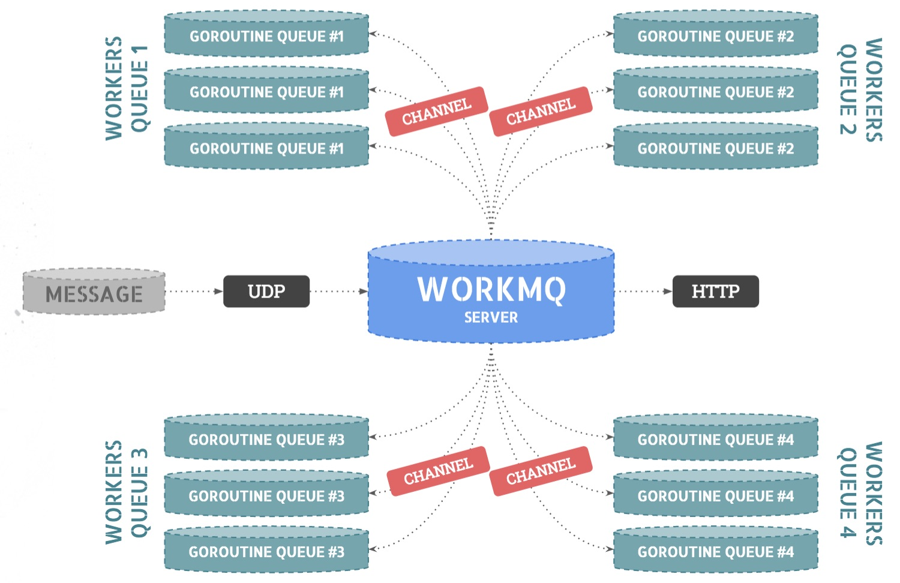

WorkMQ
======

A message queue system written in Go.

This is a message queue implementation written in Go.
It allows to declare some queues, number of workers and processors that will process data sent in these queues.

Initially used for a Golang workshop study case, we've decided to put it open-source.



# Installation

First, install it:

```go
$ go get -u github.com/unikorp/workmq
```

Then, import it in your application code:

```go
import (
    "github.com/unikorp/workmq"
)
```

# Configuration

Queues and workers configuration is managed using a `config.json` file in the root directory.

Here is an example JSON with 2 queues, listening on UDP port and exposing the given HTTP port:

```json
{
  "ports": {
    "udp": ":10001",
    "http": ":8080"
  },
  "queues": {
    "queue.1s": {
      "processor": "processor.logger.1s",
      "num_workers": 150
    },
    "queue.2s": {
      "processor": "processor.logger.2s",
      "num_workers": 200
    }
  }
}
```

Here, we have 2 queues:
* `queue.1s` that will be processed by registered processor `processor.logger.1s` and will use 150 workers (goroutines),
* `queue.2s` that will be processed by registered processor `processor.logger.2s` and will use 200 workers (goroutines).

# Usage

Here is a code example that initializes WorkMQ, registers a processor and start handling messages:

```go
package main

import (
	"fmt"
	"time"

	"github.com/unikorp/workmq"
)

func main() {
	app := workmq.Init()

	app.AddProcessor("processor.logger.1s", func(worker *workmq.Worker, message workmq.Message) {
		time.Sleep(time.Second * 1)

		fmt.Printf("Worker #%d (queue: \"%s\") manages message %s\n", worker.ID, worker.Queue, message.Body)
	})

	app.Handle()
}

```

# Send data

You can send message data over UDP by sending a JSON string with the following structure:

```
{ "queue": "queue.1s", "body": "<your data>" }
```